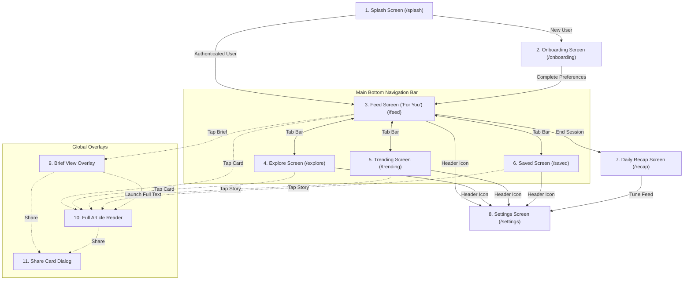

# Tattle Application - Screen Architecture & Functionality Overview

This document provides a comprehensive overview of all 11 screens, modal sheets, and dialog overlays in the **Tattle** application. Each entry includes high-resolution screenshot previews captured from Compose Multiplatform, detailed breakdown of functionality, key UI components, and exact navigation transitions.

> [!NOTE]
> **Downloadable PDF File Available:** A complete PDF version of this documentation with formatted layouts and high-resolution screenshot cards is saved at:
> `F:\Tech-Folder/MyApplication/Tattle_Application_Screens_Documentation.pdf`

---

## 1. Application Navigation Graph & Screen Flow

The application uses Jetpack Navigation Compose with a centralized `NavHost` (`App.kt`) managing route transitions and dynamic state overlays.

---

## 2. Detailed Screen Breakdown

### 1. Splash & Authentication Screen

- **Route:** `splash`
- **File Location:** [SplashScreen.kt](file:///F:/Tech-Folder/MyApplication/app/shared/src/commonMain/kotlin/com/example/tattle/ui/screens/SplashScreen.kt)
- **Functionality & Purpose:** First point of entry for the app. Displays the Tattle logo, tagline, world map backdrop, and authentication entry points (Google OAuth, Phone SMS OTP, or Email sign-in).
- **Core UI Components:**
  - World map watermark background.
  - Branded Tattle logo with drop-shadow effect.
  - Social authentication action buttons.
  - Language selector dropdown.
- **Navigation Connections:**
  - Navigates to `OnboardingScreen` if the user has not completed initial setup.
  - Navigates directly to `FeedScreen` if the user session is already authenticated.

---

### 2. Onboarding & Personalization Screen

- **Route:** `onboarding`
- **File Location:** [OnboardingScreen.kt](file:///F:/Tech-Folder/MyApplication/app/shared/src/commonMain/kotlin/com/example/tattle/ui/screens/OnboardingScreen.kt)
- **Functionality & Purpose:** Onboards new users by verifying age (DOB input), configuring notification preferences, and selecting preferred tech/news sectors to train the AI recommendation engine.
- **Core UI Components:**
  - Step indicator progress header.
  - Date of birth input with 12:01 AM midnight rollover cutoff logic.
  - Multi-select interest chips (AI, Gaming, Startups, Science, World News, etc.).
  - Notification toggles for Daily Briefings, Breaking Alerts, and Streaks.
- **Navigation Connections:**
  - Back button returns to `SplashScreen`.
  - Completion saves `UserPreferences` via `AppViewModel` and navigates to `FeedScreen`.

---

### 3. Feed Screen ("For You")

- **Route:** `feed`
- **File Location:** [FeedScreen.kt](file:///F:/Tech-Folder/MyApplication/app/shared/src/commonMain/kotlin/com/example/tattle/ui/screens/FeedScreen.kt)
- **Functionality & Purpose:** Main news feed tab. Renders personalized article cards categorized by interest tabs, reading streaks, interactive community survey cards, and quick summary actions.
- **Core UI Components:**
  - Horizontal interest filter tabs ("For You", "AI", "Tech", "Startups").
  - Article cards with hook preview, read time, publisher badge, and blur hash image loading.
  - Reading streak badge (# days active).
  - Interactive survey/poll cards with real-time community results.
  - End of session recap banner.
- **Navigation Connections:**
  - Tap card -> Opens `FullView` overlay.
  - Tap brief icon -> Launches `BriefView` overlay.
  - Tap share -> Opens `ShareCardDialog`.
  - Tap header gear -> Navigates to `SettingsScreen`.
  - Tap session end -> Navigates to `RecapScreen`.

---

### 4. Explore & Sector Discovery Screen

- **Route:** `explore`
- **File Location:** [ExploreScreen.kt](file:///F:/Tech-Folder/MyApplication/app/shared/src/commonMain/kotlin/com/example/tattle/ui/screens/ExploreScreen.kt)
- **Functionality & Purpose:** Allows users to discover new categories, search across 16+ sectors, and view curated story collections across specialized domains.
- **Core UI Components:**
  - Search bar with real-time topic filtering.
  - Visual category grid cards with gradient backgrounds and sector icons.
  - Featured story recommendations per sector.
- **Navigation Connections:**
  - Tap sector card -> Sets feed tab and transitions to `FeedScreen`.
  - Tap article -> Opens `FullView` overlay.
  - Tap header gear -> Navigates to `SettingsScreen`.

---

### 5. Trending Stories Screen

- **Route:** `trending`
- **File Location:** [TrendingScreen.kt](file:///F:/Tech-Folder/MyApplication/app/shared/src/commonMain/kotlin/com/example/tattle/ui/screens/TrendingScreen.kt)
- **Functionality & Purpose:** Highlights viral technology developments, breaking news alerts, and most-read articles ranked dynamically by community engagement scores.
- **Core UI Components:**
  - Rank badges (#1, #2, #3 Viral Rank).
  - Breaking news alert tags.
  - Engagement metrics (views, likes, comments count).
- **Navigation Connections:**
  - Tap story -> Opens `FullView` overlay.
  - Tap header gear -> Navigates to `SettingsScreen`.

---

### 6. Saved Articles Screen

- **Route:** `saved`
- **File Location:** [SavedScreen.kt](file:///F:/Tech-Folder/MyApplication/app/shared/src/commonMain/kotlin/com/example/tattle/ui/screens/SavedScreen.kt)
- **Functionality & Purpose:** Personal offline library storing bookmarked articles for offline or deferred reading.
- **Core UI Components:**
  - Search filter bar for saved bookmarks.
  - Quick bookmark removal toggle.
  - Empty state illustration with quick discovery shortcut.
- **Navigation Connections:**
  - Tap saved card -> Opens `FullView` overlay.
  - Tap header gear -> Navigates to `SettingsScreen`.

---

### 7. Daily Recap Screen

- **Route:** `recap`
- **File Location:** [RecapScreen.kt](file:///F:/Tech-Folder/MyApplication/app/shared/src/commonMain/kotlin/com/example/tattle/ui/screens/RecapScreen.kt)
- **Functionality & Purpose:** End-of-day digest presenting total cards read, streak progress, key insights consumed today, and AI-generated daily bullet summaries.
- **Core UI Components:**
  - Reading statistics metric cards (Cards read, Streak days, Estimated time saved).
  - Key takeaways summary list.
  - "Tune Feed" shortcut button.
- **Navigation Connections:**
  - "Tune Feed" -> Navigates to `SettingsScreen`.
  - Back button -> Pops backstack.

---

### 8. Settings & Customization Screen

- **Route:** `settings`
- **File Location:** [SettingsScreen.kt](file:///F:/Tech-Folder/MyApplication/app/shared/src/commonMain/kotlin/com/example/tattle/ui/screens/SettingsScreen.kt)
- **Functionality & Purpose:** Central configuration hub for adjusting app themes (Dark/Light mode), language selection (English, Hindi), notification toggles, interest choices, and data purge.
- **Core UI Components:**
  - Dark Theme toggle switch.
  - Language selection dropdown picker.
  - Interest category chip editor.
  - Data Purge button with confirmation dialog.
- **Navigation Connections:**
  - Back -> Pops backstack to previous screen.
  - Purge Data -> Clears local database/preferences, resets app, and navigates to `SplashScreen`.

---

### 9. Brief View Overlay

- **Component Type:** Animated Bottom Sheet Overlay
- **File Location:** [BriefView.kt](file:///F:/Tech-Folder/MyApplication/app/shared/src/commonMain/kotlin/com/example/tattle/ui/screens/BriefView.kt)
- **Functionality & Purpose:** Speed-reading modal sheet sliding up from the bottom. Presents a 15-second article summary with 3 key takeaway bullet points and a "Why It Matters" highlight.
- **Core UI Components:**
  - Slide-up bottom sheet container with blurred overlay backdrop.
  - 3 Key Takeaway bullet points with highlight icons.
  - "Why It Matters" context box.
  - Bookmark & Share action icons.
  - "Read Full Article" expansion button.
- **Navigation Connections:**
  - Close (X) -> Dismisses overlay.
  - "Read Full Article" -> Launches `FullView` overlay.
  - Share -> Opens `ShareCardDialog`.

---

### 10. Full Article View Overlay

- **Component Type:** Slide-In Reader Overlay
- **File Location:** [FullView.kt](file:///F:/Tech-Folder/MyApplication/app/shared/src/commonMain/kotlin/com/example/tattle/ui/screens/FullView.kt)
- **Functionality & Purpose:** Full-screen immersive article reader featuring complete story text, publisher metadata, integrated Text-To-Speech (TTS) audio reader, font resizer, and community comments section.
- **Core UI Components:**
  - Hero image header.
  - Publisher attribution and publication timestamp.
  - Integrated TTS audio player bar with Play/Pause controls.
  - Reader controls: Font size adjustment and Theme toggle.
  - Tabbed sections: Full Story, Key Takeaways, Comments.
- **Navigation Connections:**
  - Close (Back/X) -> Dismisses reader overlay and returns to caller screen.
  - Share -> Opens `ShareCardDialog`.

---

### 11. Share Card Dialog

- **Component Type:** Modal Popup Card
- **File Location:** [ShareCardDialog.kt](file:///F:/Tech-Folder/MyApplication/app/shared/src/commonMain/kotlin/com/example/tattle/ui/components/ShareCardDialog.kt)
- **Functionality & Purpose:** Generates a visually styled share card preview with article headline, QR code link, and summary snippet for sharing via social media or system share intent.
- **Core UI Components:**
  - Styled card preview with Tattle branding.
  - QR Code pointing to article source URL.
  - "Share Text" and "Share Image" confirmation buttons.
- **Navigation Connections:**
  - Dismiss -> Closes dialog.
  - Confirm Share -> Invokes native system share sheet via platform `ShareUtils`.
