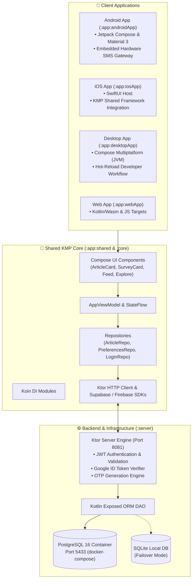

# 📰 Tattle — AI-Curated Real-Time News & Insights Ecosystem

[](https://kotlinlang.org/docs/multiplatform.html)
[](https://www.jetbrains.com/lp/compose-multiplatform/)
[](https://ktor.io/)
[](https://developer.android.com/)
[](https://developer.apple.com/ios/)
[](https://kotlinlang.org/docs/desktop-overview.html)
[](https://kotl.in/wasm)
[](https://www.postgresql.org/)
[](https://www.docker.com/)

---

## 📌 Executive Summary

**Tattle** is an industry-grade, cross-platform news and intelligence ecosystem powered by **Kotlin Multiplatform (KMP)** and **Compose Multiplatform (CMP)**. Tattle transforms high-volume news sources into concise, 30-second AI-curated digest cards, providing users with instant summaries, key takeaways, and "Why It Matters" analytical insights across **Android**, **iOS**, **Desktop (JVM)**, **Web (Wasm & JS)**, and a dedicated **Ktor Server** backend.

Engineered with clean architectural principles (MVVM, Dependency Injection via Koin, Unidirectional Data Flow) and modern cloud-native backend integration, Tattle delivers unified cross-platform UX with native performance on every target.

---

## 🚀 Key Features & Architectural Highlights

### 🤖 AI-Curated Intelligence & Content Delivery
* **Sector-Based Feeds**: Dynamic categorization across AI, Technology, World News, Business, Finance, and Culture.
* **Smart Summaries**: AI-extracted 30-second read hooks, structured bullet takeaways, and context-aware *"Why It Matters"* impact analysis.
* **Real-Time Polling & Live Updates**: Automatic background polling for incoming article revisions and breaking news alerts.
* **Interactive Content Cards**: Rich article cards with built-in engagement metrics (likes, reactions, comments, interactive inline surveys).

### 📱 Unified Cross-Platform Clients
* **Compose Multiplatform UI**: 100% shared UI code across Android, Desktop (JVM), and Web targets using Material 3 design system.
* **Native iOS Integration**: Shared KMP core library consumed seamlessly by Xcode/SwiftUI entry point.
* **Desktop Hot-Reloading**: Instant UI feedback during JVM desktop development via `./gradlew :app:desktopApp:hotRun`.
* **Kotlin/Wasm & Web Support**: High-performance WebAssembly runtime targeting modern browsers alongside JS compatibility.

### ⚡ Backend Infrastructure & Services
* **High-Throughput Ktor Backend**: Ktor 3.5.0 engine utilizing Netty & CIO for non-blocking I/O.
* **Flexible Database Layer**: Kotlin Exposed ORM backed by **PostgreSQL 16** (containerized via Docker Compose) with automatic failover to **SQLite**.
* **Authentication Pipeline**: Multi-factor authentication supporting **Google OAuth 2.0 Token Verification**, **Supabase Auth**, **Firebase Auth**, and **Phone/Email OTP generation**.
* **On-Device Hardware SMS Gateway**: Native Android `SmsGatewayService` running an embedded foreground Ktor server on port 8080 to process localized OTP dispatches over physical device cellular hardware.

### 🎨 Personalization & Offline Resilience
* **Preferences Engine**: Persistence layer utilizing `multiplatform-settings` and `DataStore Preferences` for offline bookmarking, read history, streak tracking, and localized string management.
* **Koin Dependency Injection**: Modularized DI setup across common, desktop, android, and server target modules.

---

## 📐 System Architecture



---

## 🛠 Tech Stack & Tools

| Component | Technology / Library | Description |
| :--- | :--- | :--- |
| **Language** | Kotlin `2.4.0` | Modern, safe, expressive programming language |
| **UI Framework** | Compose Multiplatform `1.11.1` / Material 3 | Declarative UI for Android, Desktop, Web & iOS |
| **Server Framework** | Ktor `3.5.0` (Netty / CIO) | Asynchronous backend framework |
| **ORM & Database** | JetBrains Exposed `0.59.0` / PostgreSQL 16 / SQLite | Type-safe SQL ORM with containerized Postgres |
| **Dependency Injection** | Koin `4.0.0` | Kotlin-native lightweight DI framework |
| **Async & Concurrency**| Kotlinx Coroutines `1.11.0` & Flow | Reactive unidirectional data flow |
| **Serialization** | Kotlinx Serialization `1.8.0` / Gson | Multiplatform JSON serialization |
| **Image Loading** | Kamel Image `1.0.9` | Async image fetching and caching library |
| **Persistence** | Multiplatform Settings `1.3.0` & DataStore | Cross-platform key-value & preferences store |
| **Auth Platforms** | Supabase `3.7.0`, Google Identity, Firebase Auth | Multi-provider identity and authentication |
| **Build System** | Gradle `9.x` (AGP `9.3.2`) with Type-Safe Accessors | High-efficiency Kotlin DSL build scripts |
| **Containerization** | Docker & Docker Compose | Containerized database and service deployment |

---

## 📂 Project Structure

```
Tattle/
├── app/
│   ├── androidApp/      # Native Android application entry point & SmsGatewayService
│   ├── desktopApp/      # JVM Desktop application with Hot-Reload configuration
│   ├── iosApp/          # Native iOS Xcode project wrapping KMP shared framework
│   ├── shared/          # Shared Compose Multiplatform codebase
│   │   └── src/
│   │       ├── commonMain/   # UI, ViewModels, Models, Repositories, Koin DI
│   │       ├── androidMain/  # Android-specific platform implementations & Auth handlers
│   │       ├── iosMain/      # iOS-specific platform bridges
│   │       ├── jvmMain/      # Desktop-specific utils & window handlers
│   │       └── jsMain/       # Web browser interop code
│   └── webApp/          # Web app targeting Wasm (Kotlin/Wasm) & JavaScript
├── core/                # Shared domain logic and data structures
├── server/              # Ktor backend server with Exposed ORM, JWT, and Postgres
├── docker-compose.yml   # Docker setup for PostgreSQL 16
├── build.gradle.kts     # Root build file with buildkonfig and GMS plugins
├── settings.gradle.kts  # Project module declarations
└── README.md            # Project documentation
```

---

## 📋 Prerequisites

Ensure your environment meets the following baseline requirements before building Tattle:

* **JDK**: OpenJDK 17 or Java 21 (configured via Foojay Toolchain Plugin)
* **Android Studio**: Android Studio Ladybug / Jellyfish (or latest Stable release)
* **Android SDK**: Compile SDK `36`, Min SDK `24`
* **Xcode**: Xcode 15+ (for building and debugging iOS targets on macOS)
* **Docker & Docker Compose**: Installed and active (for PostgreSQL database container)
* **Gradle**: Handled automatically via `./gradlew` wrapper

---

## ⚡ Quick Start Guide

### 1. Clone the Repository
```bash
git clone https://github.com/developermavericks/Tattle_app_with_backend_v1.0.git
cd Tattle_app_with_backend_v1.0
git checkout ITS_DIVS
```

### 2. Launch Backend Infrastructure (PostgreSQL & Ktor Server)

Start the PostgreSQL database container:
```bash
docker compose up -d
```

Run the Ktor Server backend:
```bash
./gradlew :server:run
```
> *The server starts on `http://localhost:8081`. If PostgreSQL is offline, it gracefully falls back to `./tattle.db` (SQLite).*

---

### 3. Run Client Applications

#### 🤖 Android App
```bash
./gradlew :app:androidApp:assembleDebug
# Deploy to connected emulator/device:
./gradlew :app:androidApp:installDebug
```

#### 🖥️ Desktop App (JVM)
```bash
# Standard Execution:
./gradlew :app:desktopApp:run

# Developer Hot-Reload Mode:
./gradlew :app:desktopApp:hotRun --auto
```

#### 🌐 Web App (Wasm & JS Targets)
```bash
# WebAssembly Target (Recommended for modern browsers):
./gradlew :app:webApp:wasmJsBrowserDevelopmentRun

# JavaScript Target:
./gradlew :app:webApp:jsBrowserDevelopmentRun
```

#### 🍎 iOS App
1. Open `app/iosApp/iosApp.xcodeproj` in **Xcode**.
2. Select your target simulator or physical device.
3. Click **Run** (`Cmd + R`).

---

## 🧪 Testing Suite

Run tests across all modules and target platforms using Gradle:

```bash
# Android Host Unit Tests
./gradlew :app:shared:testAndroidHostTest

# JVM Desktop Tests
./gradlew :app:shared:jvmTest

# Server API Tests
./gradlew :server:test

# WebAssembly & JS Tests
./gradlew :app:shared:wasmJsTest
./gradlew :app:shared:jsTest

# iOS Simulator Arm64 Tests
./gradlew :app:shared:iosSimulatorArm64Test
```

---

## 🔐 API & Security Architecture

### Authentication Endpoints
The Ktor server (`:server`) exposes secure endpoints with JWT validation:

* `POST /api/auth/google` — Verifies Google ID Tokens against OAuth 2.0 Web Client ID and retrieves/creates user profile.
* `POST /api/auth/otp/generate` — Simulates/dispatches OTP codes for phone number verification.
* `POST /api/auth/otp/verify` — Validates phone OTP and returns a signed 7-day JWT auth token.
* `POST /api/auth/email/generate` — Generates email login verification codes.
* `POST /api/auth/email/verify` — Validates email OTP and returns JWT auth token.
* `GET /api/user/profile` — Protected endpoint (`Bearer <JWT>`) returning authenticated user information.

---

## 📱 Hardware SMS Gateway Feature

For high-reliability localized SMS delivery in test/production environments, the Android app incorporates `SmsGatewayService`:
* Runs as an Android **Foreground Service** with active status notifications.
* Hosts an embedded Ktor web server listening locally on port `8080`.
* Exposes `POST /send-sms` protected by a bearer API key to interface directly with `android.telephony.SmsManager` and transmit SMS over device cellular hardware.

---

## 🤝 Contributing Guidelines

1. **Fork or Checkout Feature Branch**: Create your branch off `ITS_DIVS` or `main`.
2. **Follow Coding Standards**: Adhere to official Kotlin style guidelines and Compose state management conventions.
3. **Run Verification**: Ensure all target tests pass (`./gradlew check`).
4. **Submit Pull Request**: Open a detailed PR describing your changes.

---

## 📄 License & Acknowledgments

Designed and developed for **Tattle App Platform**. All rights reserved.
